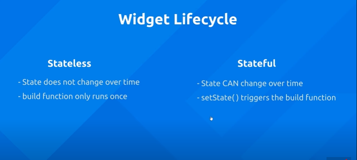
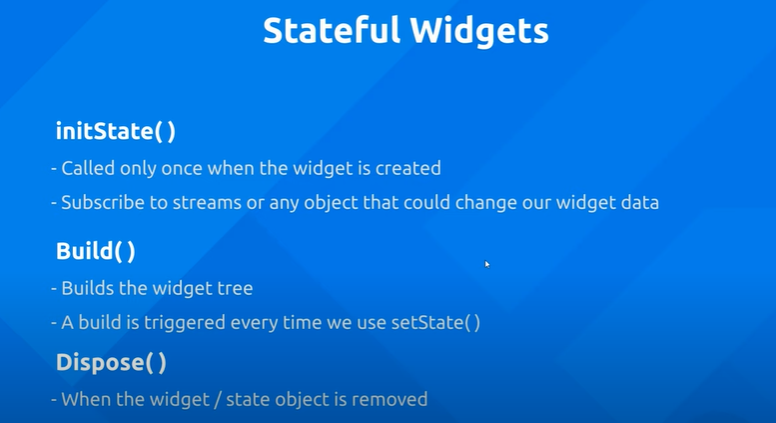

# world_timer

Check the local time of all the cities in the world.

## Getting Started

This project is a starting point for a Flutter application.

## Widget States
- 
- 
- 

## dummy api
- json placeholder -> https://jsonplaceholder.typicode.com/todos/1
- response :

            {
            "userId": 1,
            "id": 1,
            "title": "delectus aut autem",
            "completed": false
            }

-
## Add http
Run the following:

      lutter pub add http

## Add intl
Run the following:

      flutter pub add intl